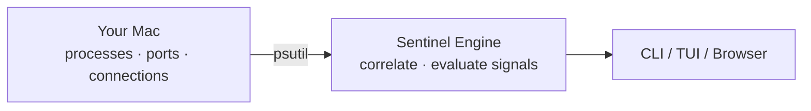

# Sentinel

[](https://github.com/EyuelAbebe/sentinel/actions/workflows/ci.yml)
[](https://www.python.org/downloads/)
[](LICENSE)

**Know what's running on your Mac.**

Sentinel watches your processes, open ports, and network connections. When something looks unusual it tells you exactly what it found and **why** — no cloud account, no root access, no noise.

---

## Install

**Requires macOS 14+, Python 3.12+**

```bash
pipx install "sentinel[tui]"   # CLI + interactive monitor
pipx install sentinel           # CLI only
```

Verify:

```bash
sentinel doctor
```

> Need pip, virtualenv, or launchd auto-start? See [docs/installation.md](docs/installation.md).

---

## Quick start

```bash
sentinel scan        # one-shot security scan
sentinel             # open interactive live monitor (TUI)
sentinel serve       # start local API + browser dashboard on :7173
```

---

## How it works



Each scan correlates every open socket back to its owning process, then evaluates signals against the combined data. Findings always include the concrete reasons they were raised.

---

## What gets flagged

| Signal | Severity |
|---|---|
| Listening on all interfaces (`0.0.0.0` / `::`) | MEDIUM |
| All-interfaces listener + suspicious path | HIGH |
| Running from `~/Downloads`, `/tmp`, `/var/tmp` | MEDIUM |
| Executable no longer exists on disk | HIGH |
| Known tracker connection | LOW |

---

<details>
<summary><strong>CLI reference</strong></summary>

```
$ sentinel scan

 ──────────────── Sentinel  Quick Scan · 14:32:06 (1.4s) ────────────────

  Processes   Ports   Connections   Attention
 ──────────────────────────────────────────────
        231      14            42         1 ⚠

 ╭─ ● unknown-helper  HIGH ──────────────────────────╮
 │  › Running from /Users/you/Downloads/              │
 │  › Listening on :4444 (TCP) — all interfaces       │
 ╰────────────────────────────────────────────────────╯

  Run sentinel watch for live interactive monitoring
```

| Command | What it does |
|---|---|
| `sentinel scan` | Security scan with findings |
| `sentinel scan --json` | Machine-readable JSON output (no ANSI) |
| `sentinel scan deep` | Deep scan: hash integrity + YARA rules |
| `sentinel processes` | Table of all running processes |
| `sentinel ports` | Listening ports with exposure levels |
| `sentinel network` | Active outbound connections |
| `sentinel baseline list` | Show baseline entries |
| `sentinel baseline add --process nginx --reason "web server"` | Suppress a known process |
| `sentinel baseline add --port 8080 --reason "dev server"` | Suppress a known port |
| `sentinel baseline remove <id>` | Remove a baseline entry |
| `sentinel serve` | Start HTTP API + browser dashboard on `:7173` |
| `sentinel doctor` | Check environment and tool availability |
| `sentinel version` | Show installed version |

```
$ sentinel ports

 Listening Ports
 ─────────────────────────────────────────────────────────────
    Port   Protocol  Process       PID    Exposure
 ─────────────────────────────────────────────────────────────
    22     TCP       sshd          891    Localhost only
  ⚠ 443    TCP       nginx         2341   All interfaces
    5432   TCP       postgres      3812   Localhost only
```

```
$ sentinel doctor

 Environment
 ──────────────────────────────────────────────────────────────────
  Check               Status   Detail
 ──────────────────────────────────────────────────────────────────
  Python ≥ 3.12       OK       3.13.1
  psutil              OK       6.0.0
  rich                OK       13.9.4
  textual             OK       0.80.1
  pydantic            OK       2.9.2
  osquery (optional)  MISSING  not found
```

</details>

---

<details>
<summary><strong>Interactive TUI monitor</strong></summary>

Run `sentinel` or `sentinel watch` to open the live monitor.

```
┌──────────────────────────────────────────────────────────────────┐
│  ⬤ PROCESSES   ◆ PORTS   ⇄ CONNECTIONS   ● ATTENTION            │
│       231          14           42             1 ⚠               │
├──────────────────────────────────────────────────────────────────┤
│  ⚠ 1 finding needs attention  · scanned 14:32:06  (1.4s)        │
├── NEEDS ATTENTION ───────────────────────────────────────────────┤
│  ● HIGH  unknown-helper                                          │
│          subject: unknown-helper (pid 4521)                      │
│          › Running from /Users/you/Downloads/                    │
├── LIVE ACTIVITY ─────────────────────────────────────────────────┤
│  14:32:07  PROCESS_STARTED   Chrome Helper (pid 8831)            │
│  14:32:05  CONNECTION_OPENED  api.example.com:443                │
└──────────────────────────────────────────────────────────────────┘
 1 Overview  2 Apps  3 Network  4 Findings  s Rescan  p Pause  ? Help
```

**Tabs**

| Tab | What it shows |
|---|---|
| **1 Overview** | Stat bar, scan status, findings summary, live activity stream |
| **2 Apps** | All processes with open ports; flag icon shows severity |
| **3 Network** | Listening ports + active connections; ⚠ = all-interfaces risk |
| **4 Findings** | All findings sorted by severity with full detail panel |

**Key bindings**

| Key | Action |
|---|---|
| `1` `2` `3` `4` | Switch tabs |
| `Tab` / `Shift-Tab` | Cycle tabs |
| `↑` `↓` / `Enter` | Navigate lists and inspect rows |
| `s` | Rescan now |
| `p` | Pause / resume background monitoring |
| `?` | Open help screen |
| `q` | Quit |

</details>

---

<details>
<summary><strong>Browser dashboard</strong></summary>

Run `sentinel serve` then open **http://localhost:7173** in any browser.

```
┌──── SENTINEL Live Dashboard ──────────────────────────────────────────┐
│  ⬤ Processes  ◆ Ports  ⇄ Connections  ● Attention                   │
│       231        14           42            1                          │
├── Needs Attention ────────────┬── Listening Ports ────────────────────┤
│  HIGH  unknown-helper         │  ⚠ :4444  TCP  unknown-helper         │
│  subject: pid 4521            │     :22   TCP  sshd                   │
│  › From /Downloads/           │     :5432 TCP  postgres               │
├── Live Activity ──────────────┴───────────────────────────────────────┤
│  14:32:07  PROCESS_STARTED  Chrome Helper (pid 8831)                  │
│  14:32:05  CONNECTION_OPENED  → api.example.com:443                   │
└───────────────────────────────────────────────────────────────────────┘
```

**API endpoints** (served on the same port):

| Endpoint | Description |
|---|---|
| `GET /` | Browser dashboard |
| `GET /scan` | Run scan, return JSON results |
| `GET /findings` | Query persisted findings from SQLite |
| `GET /baseline` | List baseline entries |
| `GET /health` | Liveness probe |
| `WS /events` | Stream live domain events |

The dashboard connects to `WS /events` for real-time updates and polls `/scan` every 30 seconds. It reconnects automatically on disconnect.

</details>

---

## Permissions

Sentinel runs as a normal user — no root, no admin, no special entitlements.

| What | Without root | With `sudo` |
|---|---|---|
| Your own processes | All | All |
| System processes | Partial | All |
| Port owners (SIP-protected) | Partial | All |

Run `sentinel doctor` to see exactly what is visible in your environment.

---

## Docs

| | |
|---|---|
| [Installation guide](docs/installation.md) | pipx, pip, launchd, upgrade, uninstall |
| [Contributing](docs/contributing.md) | Dev setup, branching, PR process |
| [Architecture](docs/architecture.md) | Layer diagram, scan pipeline, design decisions |
| [Privacy model](docs/privacy-model.md) | What is and isn't collected or stored |
| [Release process](docs/release-process.md) | RC and production release workflow |

---

## License

MIT — see [LICENSE](LICENSE).
