# Sentinel

[](https://github.com/EyuelAbebe/sentinel/actions/workflows/ci.yml)
[](https://www.python.org/downloads/)
[](LICENSE)

**Know what's running on your Mac.**

Sentinel watches your processes, open ports, and network connections. When something looks unusual it tells you exactly what it found and **why** — no cloud account, no root access, no noise.

---

## Live monitor

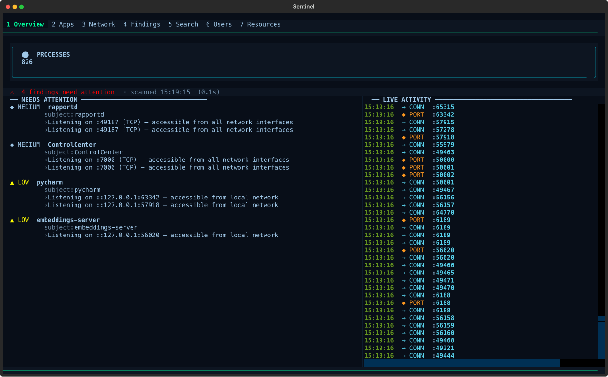

Run `sentinel` to open the interactive live monitor. Press `?` for help, `s` to rescan, `1–7` to switch tabs.

---

## Install

**Requires macOS 14+, Python 3.12+**

```bash
git clone https://github.com/EyuelAbebe/sentinel.git
cd sentinel
pip install poetry && poetry install
```

Verify:

```bash
poetry run sentinel doctor
```

> **Tip:** run `source .venv/bin/activate` once so you can type `sentinel` directly without the `poetry run` prefix.

> For pip, pipx, and upgrade instructions see [docs/installation.md](docs/installation.md).

---

## Quick start

```bash
sentinel scan        # one-shot security scan
sentinel             # open interactive live monitor (TUI)
sentinel serve       # start HTTP API + browser dashboard on :7173
```

### Run as a background service (auto-start at login)

```bash
poetry install --extras api   # install the API server dependency
sentinel service install      # register with launchd and start at login
```

Manage it:

```bash
sentinel service status       # running? PID? API reachable?
sentinel service stop         # stop without uninstalling
sentinel service start        # start again
sentinel service restart      # restart (e.g. after an upgrade)
sentinel service uninstall    # remove from launchd entirely
```

---

## TUI screens

### Apps — all processes, flagged by severity

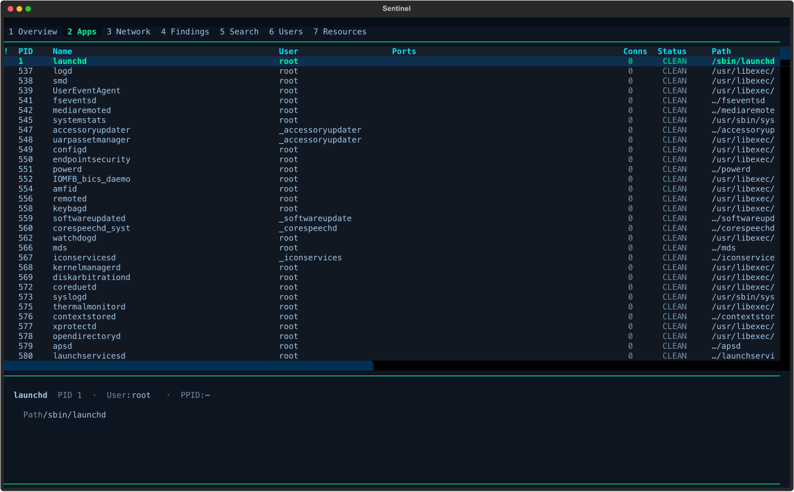

### Network — listening ports and active connections side by side

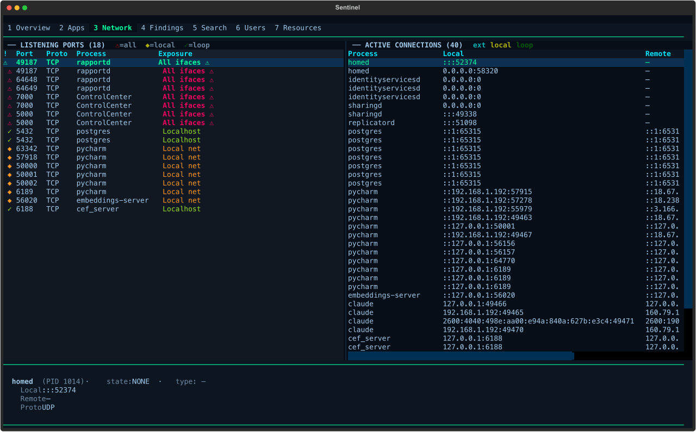

### Findings — what was flagged and why

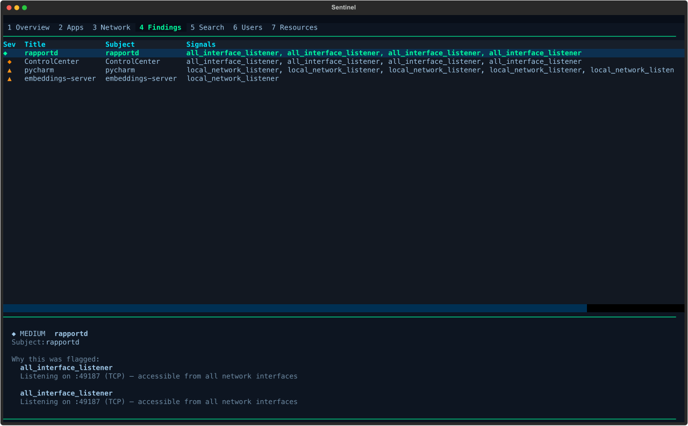

### Search — filter across all processes, ports, and connections

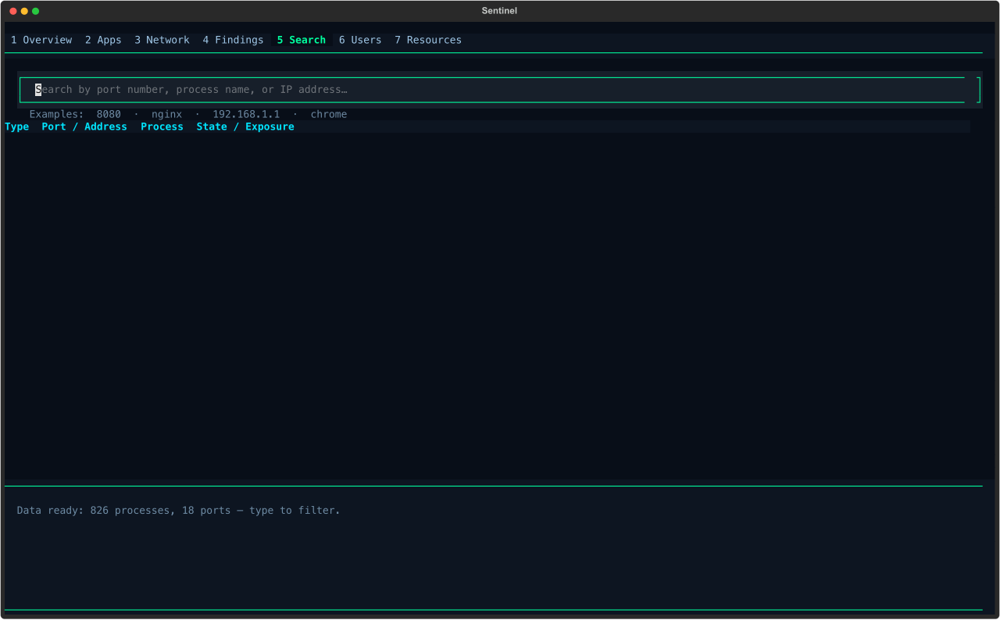

### Users — who is running what

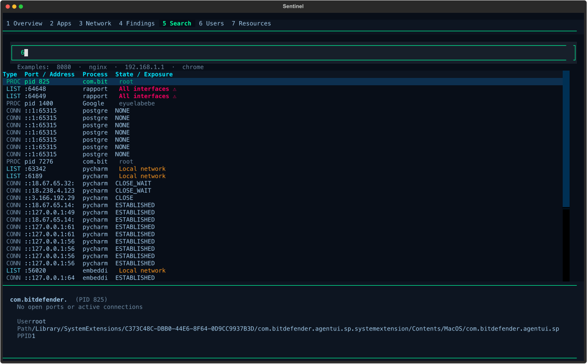

### Resources — CPU, memory, and disk at a glance

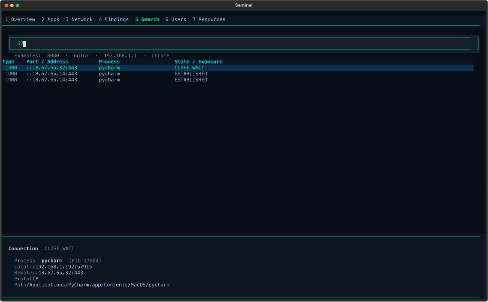

---

## Browser dashboard

Run `sentinel serve` then open **http://localhost:7173** in any browser.

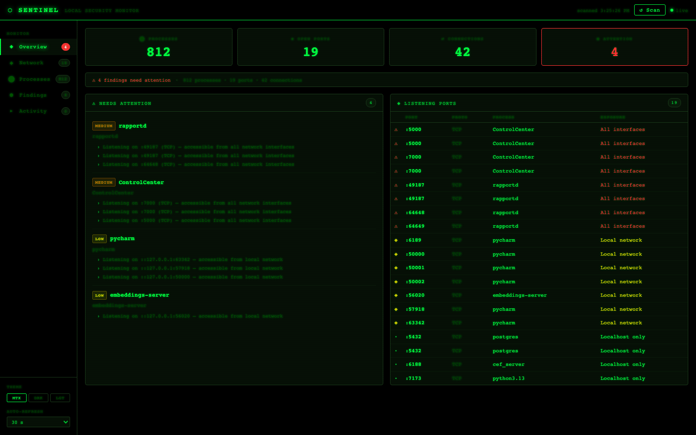

The dashboard polls `/scan` every 30 seconds and streams live events over WebSocket. No login, no setup.

<details>
<summary>More dashboard views</summary>

**Network**

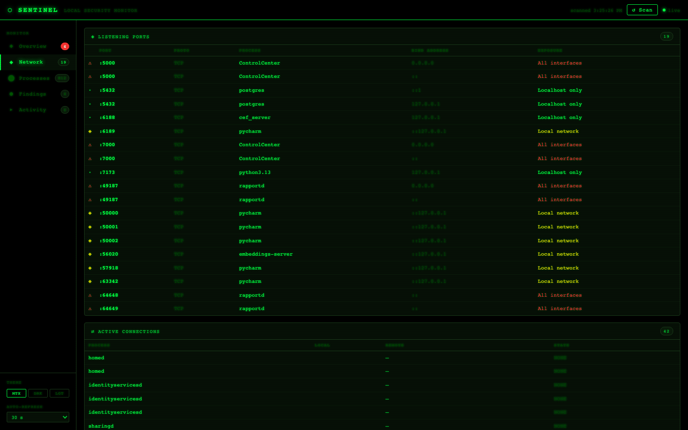

**Processes**

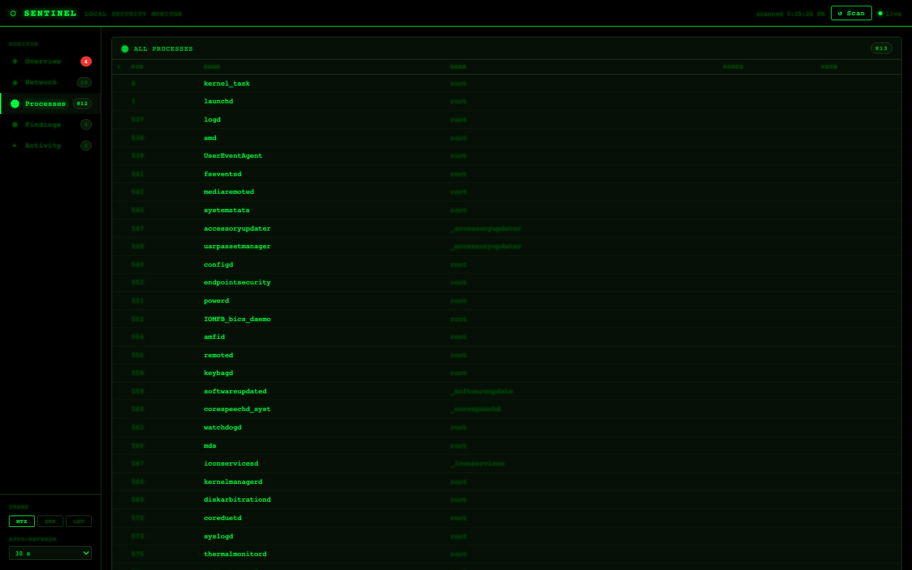

**Findings**

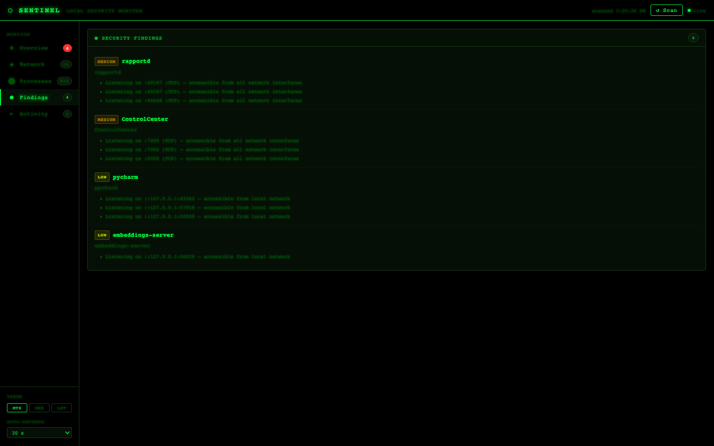

**Activity feed**

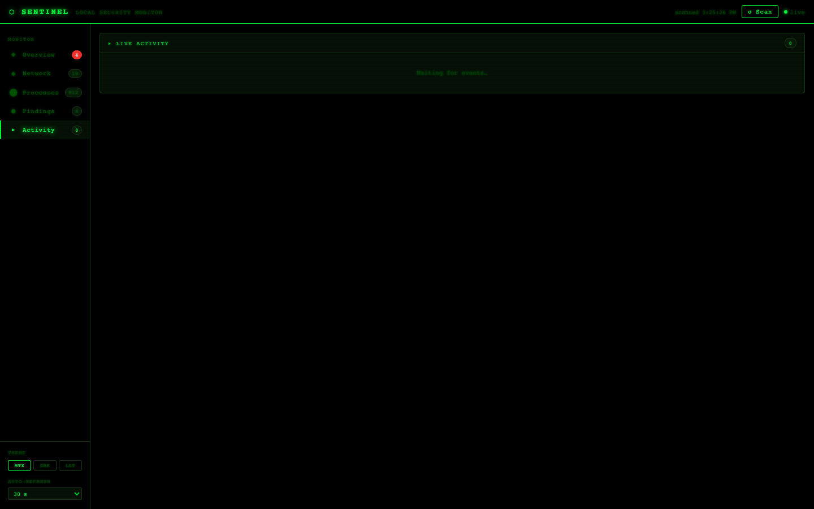

</details>

**API endpoints** (same port as the dashboard):

| Endpoint | Description |
|---|---|
| `GET /` | Browser dashboard |
| `GET /scan` | Run scan and return JSON |
| `GET /findings` | Query persisted findings from SQLite |
| `GET /baseline` | List baseline entries |
| `GET /health` | Liveness probe |
| `WS /events` | Stream live domain events |

---

## What gets flagged

| Signal | Severity |
|---|---|
| Listening on all interfaces (`0.0.0.0` / `::`) | MEDIUM |
| All-interfaces listener + suspicious executable path | HIGH |
| Running from `~/Downloads`, `/tmp`, `/var/tmp` | MEDIUM |
| Executable no longer exists on disk | HIGH |

Every finding shows the exact signals that triggered it. Sentinel never says "unknown = dangerous."

---

<details>
<summary><strong>CLI reference</strong></summary>

| Command | What it does |
|---|---|
| `sentinel scan` | Security scan with findings |
| `sentinel scan --json` | Machine-readable JSON output (no ANSI) |
| `sentinel processes` | Table of all running processes |
| `sentinel ports` | Listening ports with exposure levels |
| `sentinel network` | Active outbound connections |
| `sentinel baseline list` | Show baseline entries |
| `sentinel baseline add --process nginx --reason "web server"` | Suppress a known process |
| `sentinel baseline add --port 8080 --reason "dev server"` | Suppress a known port |
| `sentinel baseline remove <id>` | Remove a baseline entry |
| `sentinel serve` | Start HTTP API + browser dashboard on `:7173` |
| `sentinel doctor` | Check environment and tool availability |
| `sentinel version` | Show installed version |

</details>

---

## Key bindings (TUI)

| Key | Action |
|---|---|
| `1` – `7` | Switch tabs |
| `←` `→` | Cycle tabs |
| `↑` `↓` | Navigate rows |
| `s` | Rescan now |
| `p` | Pause / resume live monitoring |
| `/` | Jump to Search |
| `?` | Open help screen |
| `q` | Quit |

---

## Permissions

Sentinel runs as a normal user — no root, no admin, no special entitlements.

| What | Without root | With `sudo` |
|---|---|---|
| Your own processes | All | All |
| System processes | Partial | All |
| Port owners (SIP-protected) | Partial | All |

Run `sentinel doctor` to see exactly what is visible in your environment.

---

## Docs

| | |
|---|---|
| [Installation guide](docs/installation.md) | Source install, pip, pipx, launchd, upgrade |
| [Contributing](docs/contributing.md) | Dev setup, branching, PR process |
| [Architecture](docs/architecture.md) | Layer diagram, scan pipeline, design decisions |
| [Privacy model](docs/privacy-model.md) | What is and isn't collected or stored |
| [Release process](docs/release-process.md) | RC and production release workflow |

---

## License

MIT — see [LICENSE](LICENSE).
