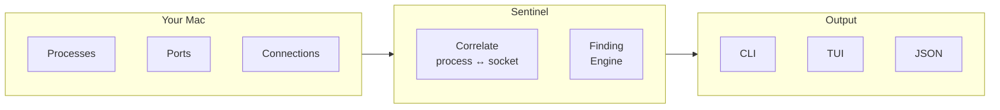

# Sentinel

[](https://github.com/EyuelAbebe/sentinel/actions/workflows/ci.yml)
[](https://www.python.org/downloads/)
[](LICENSE)

**Know what's running on your Mac.**

Sentinel watches your processes, open ports, and network connections. When something looks unusual it tells you exactly what it found and **why** — no cloud account, no root access, no noise.

---

## See it in action

```
$ sentinel scan

 ──────────────── Security Scan ────────────────

  Processes   Listening ports   Connections   Attention
 ────────────────────────────────────────────────────
        231                14            42           1

 ────────────────────────────────────────────────────

 ╭─ ● unknown-helper  HIGH ──────────────────────────╮
 │  › Running from /Users/you/Downloads/             │
 │  › Listening on :4444 (TCP) — all interfaces      │
 ╰────────────────────────────────────────────────────╯
```

```
$ sentinel ports

 Listening Ports
 ─────────────────────────────────────────────────────────────────
  Port   Protocol  Process       PID    Exposure
 ─────────────────────────────────────────────────────────────────
  22     TCP       sshd          891    Localhost only
  443    TCP       nginx         2341   All interfaces
  5432   TCP       postgres      3812   Localhost only
```

```
$ sentinel doctor

 Environment
 ──────────────────────────────────────────────────────────────────
  Check               Status   Detail
 ──────────────────────────────────────────────────────────────────
  Python ≥ 3.12       OK       3.12.3
  psutil              OK       5.9.8
  rich                OK       13.7.1
  textual             OK       0.80.1
  pydantic            OK       2.6.0
  osquery (optional)  MISSING  not found
```

---

## Install

**Requires macOS 14+, Python 3.12+**

```bash
pipx install "sentinel[tui]"   # recommended — CLI + interactive monitor
pipx install sentinel           # CLI only
```

Verify:

```bash
sentinel doctor
```

> Need pip, virtualenv, or launchd auto-start? See [docs/installation.md](docs/installation.md).

---

## Quick start

```bash
sentinel scan        # security scan — processes, ports, findings
sentinel             # open the interactive live monitor
sentinel scan --json # machine-readable output (no ANSI)
```

---

## How it works



Each scan correlates every listening port and active connection back to its owning process. The finding engine evaluates signals against the correlated data — it never flags something without a concrete reason.

---

## Commands

| Command | Description |
|---|---|
| `sentinel scan` | Security scan with findings |
| `sentinel scan --json` | Same, machine-readable JSON |
| `sentinel processes` | Table of running processes |
| `sentinel ports` | Listening ports with exposure level |
| `sentinel network` | Active outbound connections |
| `sentinel doctor` | Check environment and tool availability |
| `sentinel version` | Show installed version |
| `sentinel` | Open interactive TUI monitor |

---

## What gets flagged

| Signal | Severity |
|---|---|
| Listening on all interfaces (`0.0.0.0` / `::`) | MEDIUM |
| Listening on all interfaces + suspicious path | HIGH |
| Running from `~/Downloads`, `/tmp`, `/var/tmp` | MEDIUM |
| Executable no longer exists on disk | HIGH |

Every finding shows the exact reasons it was raised. Sentinel never says "unknown = dangerous."

---

## Permissions

Sentinel runs as a normal user — no root, no admin, no special entitlements.

| What | Without root | With `sudo` |
|---|---|---|
| Your own processes | All | All |
| System processes | Partial | All |
| Port owners (SIP-protected) | Partial | All |

Run `sentinel doctor` to see exactly what is visible in your environment.

---

## Docs

| | |
|---|---|
| [Installation guide](docs/installation.md) | pipx, pip, launchd, upgrade, uninstall |
| [Contributing](docs/contributing.md) | Dev setup, branching, PR process |
| [Architecture](docs/architecture.md) | Layer diagram, scan pipeline, design decisions |
| [Privacy model](docs/privacy-model.md) | What is and isn't collected or stored |
| [Release process](docs/release-process.md) | RC and production release workflow |

---

## License

MIT — see [LICENSE](LICENSE).
