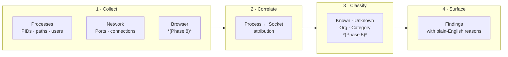

# Sentinel

**Local security and privacy monitoring for your Mac.**

Sentinel watches your running processes, open ports, and network connections in real time and surfaces anything that deserves your attention — without requiring a cloud account, root access, or a security degree to understand the output.

---

## What it answers

| Question | Where to look |
|---|---|
| What programs are running right now? | `sentinel processes` · Apps tab |
| What ports are open and who owns them? | `sentinel ports` · Network tab |
| What external services are programs talking to? | `sentinel network` · Network tab |
| What browser tracking is happening? | Privacy tab *(Phase 8)* |
| Is anything unusual, suspicious, or known malicious? | `sentinel scan` · Findings tab |

---

## Install

**Requirements:** macOS 14+, Python 3.12+

### Option A — CLI only (no interactive TUI)

The CLI covers `sentinel scan`, `sentinel processes`, `sentinel ports`, and `sentinel network`.

```bash
pip install sentinel
sentinel doctor    # verify your environment
sentinel scan      # run your first scan
```

### Option B — CLI + interactive TUI

Includes the Textual-based live monitor (`sentinel` with no arguments).

```bash
pip install "sentinel[tui]"
sentinel          # open the interactive monitor
```

### Option C — pipx (recommended for global install)

[pipx](https://pipx.pypa.io) installs Sentinel in its own isolated environment and puts the `sentinel` command on your PATH.

```bash
# CLI only
pipx install sentinel

# CLI + TUI
pipx install "sentinel[tui]"

sentinel doctor
```

### Option D — from source (development)

```bash
git clone https://github.com/EyuelAbebe/sentinel.git
cd sentinel
poetry install          # installs CLI + TUI + dev tools
poetry run sentinel doctor
poetry run sentinel scan
poetry run sentinel     # open the interactive monitor
```

---

## Example output

```
Security Scan Complete

  Processes   Listening ports   Connections   Attention
 ─────────────────────────────────────────────────────
        231                14            42           1

╭─ ! unknown-helper  HIGH ──────────────────────────────────╮
│   Running from /Users/you/Downloads/unknown-helper        │
│   Listening on :4444 (TCP) — accessible from all          │
│   network interfaces                                      │
╰───────────────────────────────────────────────────────────╯
```

Sentinel explains *why* something is flagged. It never says "unknown = dangerous" — it shows you the evidence and lets you decide.

---

## How it works



Everything stays on your machine. No data leaves your device.

---

## Commands

### Interactive monitor

```bash
sentinel          # open TUI (same as sentinel watch)
sentinel watch    # same
```

The TUI has five tabs — **Overview, Apps, Network, Privacy, Findings** — and refreshes automatically. Press `?` at any time for keyboard help.

### One-shot scans

```bash
sentinel scan             # quick scan, human-readable output
sentinel scan quick       # same
sentinel scan --json      # machine-readable JSON (no ANSI codes)
sentinel scan deep        # deep scan with hashes + YARA-X (Phase 7)
```

### Focused views

```bash
sentinel processes        # table of running processes
sentinel ports            # table of listening ports with exposure level
sentinel network          # table of active connections
```

### Utilities

```bash
sentinel version          # show installed version
sentinel doctor           # check environment and optional tool availability
```

---

## TUI keyboard reference

| Key | Action |
|---|---|
| `↑` / `↓` | Navigate |
| `Enter` | Inspect selected item |
| `Esc` | Go back |
| `s` | Rescan now |
| `p` | Pause / resume live display |
| `1–4` | Jump to Overview / Apps / Network / Findings |
| `?` | Help screen |
| `q` | Quit |

---

## Platform support

| Platform | Status |
|---|---|
| macOS 14+ (Apple Silicon) | Supported |
| macOS 14+ (Intel) | Supported |
| Linux | Roadmap |
| Windows | Roadmap |

---

## Permissions

Sentinel requires **no root or admin access** to run. Some data is unavailable without elevated privileges due to macOS System Integrity Protection:

| Feature | Without elevated access | With elevated access |
|---|---|---|
| Process list | All user processes; partial system processes | All processes |
| Open ports & connections | Partial (SIP-protected processes excluded) | Full |
| File hashes | Accessible paths only | All paths |

Run `sentinel doctor` to see exactly what is available in your environment.

To get full network visibility on macOS you can run with `sudo`:

```bash
sudo sentinel scan
```

---

## What Sentinel does not do

- Replace an antivirus or EDR product
- Guarantee that "unknown" means safe or dangerous
- Block, quarantine, or kill any process
- Mutate firewall rules
- Send any data off your machine (local-only by design)
- Perform full-disk malware scanning on every file

---

## Privacy

All data collected by Sentinel stays on your machine.

- No cloud backend. No telemetry. No account required.
- Cookie values are never stored (metadata only).
- Browser URLs are not persisted by default (host/domain only).
- Optional reputation lookups, when added, will be explicitly opt-in.

See [`docs/privacy-model.md`](docs/privacy-model.md) for the full policy.

---

## Development

### Setup

```bash
poetry install            # install all dependencies including dev
poetry run sentinel       # run from source
```

### Common tasks

```bash
make test                 # run the test suite
make lint                 # ruff check + format check
make fmt                  # auto-fix formatting and lint issues
make typecheck            # mypy strict mode
```

### Bumping the version

```bash
make bump-patch           # 0.1.0 → 0.1.1  (bug fix)
make bump-minor           # 0.1.0 → 0.2.0  (new feature)
make bump-major           # 0.1.0 → 1.0.0  (breaking change)
```

After bumping, commit `pyproject.toml` and `poetry.lock` together.

### Project layout

```
src/sentinel/
├── domain/         Pure models and enums — no I/O dependencies
├── application/    Orchestration: scan, correlation, finding engine
├── collectors/     psutil-based process and network collection
├── adapters/       Optional: osquery, YARA-X, tracker data (later phases)
├── cli/            Typer commands + Rich / JSON renderers
├── tui/            Textual interactive terminal application
└── storage/        SQLite + Alembic migrations (Phase 4+)

tests/
├── unit/           Fast, fixture-driven logic tests
└── integration/    Tests that touch real processes and sockets
```

---

## Roadmap

```mermaid
flowchart LR
    P0["✅ Phase 0\nBootstrap"]
    P1["✅ Phase 1\nDomain core"]
    P2["✅ Phase 2\nQuick scan"]
    P3["✅ Phase 3\nTUI"]
    P4["Phase 4\nLive monitoring\n+ SQLite"]
    P5["Phase 5\nClassification\nengine"]
    P6["Phase 6\nBaselines\n+ Findings"]
    P7["Phase 7\nDeep scan\n+ YARA-X"]
    P8["Phase 8\nBrowser\nextension"]
    P9["Phase 9\nGUI\n+ Local API"]
    P10["Phase 10\nZeek /\nSuricata"]
    P11["Phase 11\nPackaging\n+ Release"]

    P0 --> P1 --> P2 --> P3 --> P4 --> P5 --> P6 --> P7 --> P8 --> P9 --> P10 --> P11

    style P0 fill:#d4edda,stroke:#28a745
    style P1 fill:#d4edda,stroke:#28a745
    style P2 fill:#d4edda,stroke:#28a745
    style P3 fill:#d4edda,stroke:#28a745
```



| Phase | Description | Status |
|---|---|---|
| 0 | Repository bootstrap, CLI skeleton, doctor | ✅ Done |
| 1 | Domain core and event model | ✅ Done |
| 2 | Quick scan — processes, ports, connections | ✅ Done |
| 3 | Interactive Textual TUI | ✅ Done |
| 4 | Live monitoring and persistent event history (SQLite) | Planned |
| 5 | Identity and classification engine | Planned |
| 6 | Baselines and explainable findings | Planned |
| 7 | Deep scan and YARA-X enrichment | Planned |
| 8 | Browser privacy extension (Chrome / Firefox) | Planned |
| 9 | Standalone GUI and local HTTP/WebSocket API | Planned |
| 10 | Optional Zeek / Suricata adapters | Planned |
| 11 | Packaging, signing, hardening, and release | Planned |

---

## Contributing

1. Fork the repo and create a feature branch.
2. Run `poetry install` and confirm `make test` passes.
3. Keep changes scoped to the active phase — don't start Phase 5 work in a Phase 4 PR.
4. Add tests for any new logic in `src/sentinel/application/` or `src/sentinel/domain/`.
5. Open a PR with a clear description of what changed and why.

New architectural decisions go in `docs/decisions/` as ADR files before implementation begins.

---

## License

MIT — see `LICENSE`.
