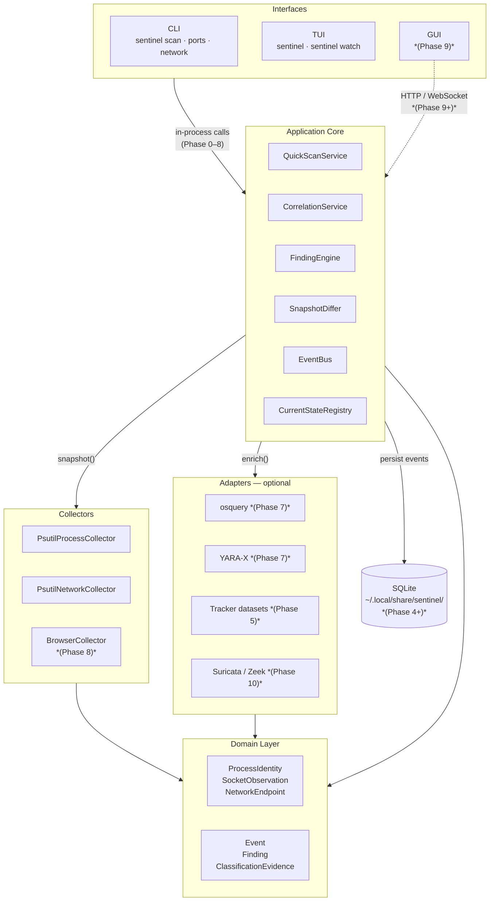
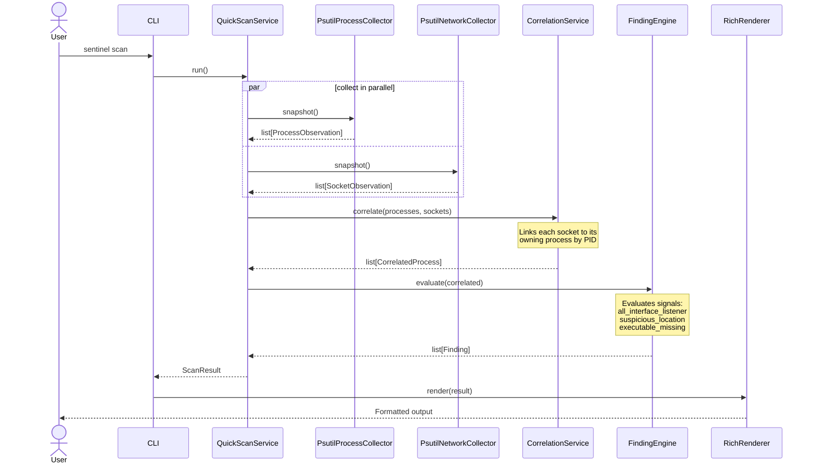
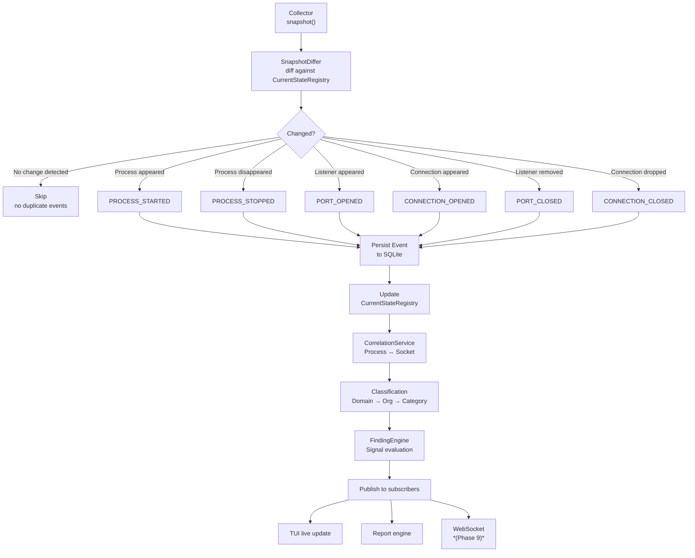
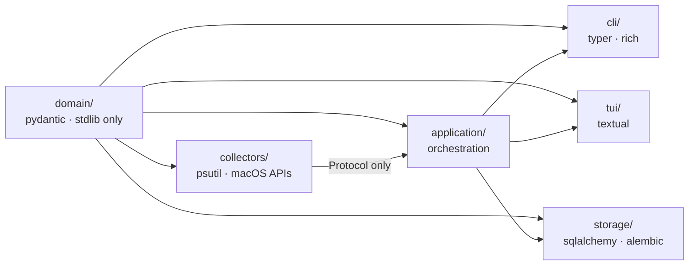

# Architecture

Sentinel is built around a single principle: **one engine, many interfaces**. The CLI, TUI, and future GUI all call the same application services. There is no separate scanning logic for each interface.

---

## Component overview



`*` GUI technology decision deferred until the local API layer is proven (Phase 9 ADR).

---

## How a scan works

The sequence below shows exactly what happens when a user runs `sentinel scan`.



---

## Event pipeline (Phase 4+)

Once live monitoring is active, snapshots are diffed continuously. Only *changes* produce events — polling a stable listener 100 times does not create 100 events.



---

## Layers in detail

### Domain — `src/sentinel/domain/`

The domain layer owns the data structures and vocabulary of the system. It has **zero dependencies** on collectors, storage, UI, or the network. Every other layer depends on it; it depends on nothing but Python and Pydantic.

| Type | Purpose |
|---|---|
| `ProcessIdentity` | A running process: pid, name, exe path, user, start time |
| `ProcessInstance` | A `ProcessIdentity` plus a stable `instance_id` (survives PID reuse) |
| `SocketObservation` | A socket: local endpoint, remote endpoint, state, exposure level |
| `NetworkEndpoint` | An address+port with optional hostname, org, and category |
| `Event` | A versioned, timestamped change event (`PROCESS_STARTED`, `PORT_OPENED`, …) |
| `Finding` | A human-readable security alert with reasons and evidence references |
| `ClassificationEvidence` | Identity/category evidence for a domain or IP from a specific source |

**PID reuse is handled correctly.** A process is identified by `(pid, start_time)`, not pid alone. The `instance_id` is a deterministic UUID5 derived from that pair so historical records stay valid even after an OS reuses a PID.

---

### Application — `src/sentinel/application/`

The application layer orchestrates the system. It reads from collectors, computes events, and produces findings. It has no UI dependency.

| Component | Responsibility |
|---|---|
| `QuickScanService` | Collects a snapshot, correlates process↔socket, runs the finding engine, returns a `ScanResult` |
| `CorrelationService` | Links each `SocketObservation` to its owning `ProcessObservation` by PID |
| `FindingEngine` | Evaluates independent signals against correlated data and produces `Finding` objects |
| `SnapshotDiffer` | Diffs two consecutive snapshots to produce a list of `Event` objects |
| `CurrentStateRegistry` | In-memory map of the latest observed processes and sockets |
| `EventBus` | In-process async pub/sub for domain events |

**Findings are signal-based, not score-based.** Every finding lists the specific signals that triggered it (e.g. `all_interface_listener`, `suspicious_location`). A severity is *derived* from those signals — never hard-coded in the UI.

---

### Collectors — `src/sentinel/collectors/`

Collectors implement two protocols defined in `base.py`:

```python
class ProcessCollector(Protocol):
    async def snapshot(self) -> list[ProcessObservation]: ...

class NetworkCollector(Protocol):
    async def snapshot(self) -> list[SocketObservation]: ...
```

Current implementations:

| Collector | Source | Notes |
|---|---|---|
| `PsutilProcessCollector` | `psutil.process_iter()` | Skips inaccessible processes gracefully |
| `PsutilNetworkCollector` | `psutil.net_connections()` | Falls back to empty list on `AccessDenied` |

Later implementations (native macOS Endpoint Security, osquery) will satisfy the same protocols without touching the application layer.

---

### Adapters — `src/sentinel/adapters/`

Optional integrations that enrich data without being required for core operation.

| Adapter | Phase | Purpose |
|---|---|---|
| osquery | 7 | Cross-verification, file hashes, launch agents, persistence |
| YARA-X | 7 | File-pattern malware scanning for selected executables |
| Tracker datasets | 5 | Domain → category classification (Analytics, Tracking, CDN, …) |
| Suricata | 10 | IDS/network threat signature enrichment |
| Zeek | 10 | Detailed network metadata and protocol analysis |

`sentinel doctor` reports the availability of each optional adapter.

---

### CLI — `src/sentinel/cli/`

Thin wrappers around application services using [Typer](https://typer.tiangolo.com) for command routing and [Rich](https://rich.readthedocs.io) for formatting. The CLI contains no business logic — it calls `QuickScanService`, passes the result to a renderer, and exits.

Two renderers:
- `RichRenderer` — tables, panels, colour, progressive disclosure
- `JsonRenderer` — clean JSON with no ANSI escape codes (`sentinel scan --json`)

---

### TUI — `src/sentinel/tui/`

An interactive terminal application built with [Textual](https://textual.textualize.io). It calls the same `QuickScanService` in-process and refreshes on a configurable interval.

| Screen | Contents |
|---|---|
| Overview | Summary counts, attention items, live activity log |
| Apps | Sortable process table with per-process detail panel |
| Network | Listeners table + connections table with exposure badges |
| Findings | Findings list with expandable reason detail |
| Help | Keyboard reference |

---

### Storage — `src/sentinel/storage/`

Introduced in **Phase 4**. SQLite in WAL mode via SQLAlchemy and Alembic. Separate logical repositories for current state, event history, findings, baselines, classification cache, and settings.

Default path: `~/.local/share/sentinel/sentinel.db`  
Override with: `SENTINEL_DATA_DIR=/your/path`

---

## Dependency constraints



| Layer | May depend on | Must not depend on |
|---|---|---|
| `domain/` | `pydantic`, Python stdlib | Everything else |
| `application/` | `domain/`, `collectors/` (protocols) | `cli/`, `tui/`, `storage/` directly |
| `collectors/` | `domain/`, `psutil`, macOS APIs | `application/`, `cli/`, `tui/` |
| `cli/` | `application/`, `domain/`, `rich`, `typer` | `tui/` |
| `tui/` | `application/`, `domain/`, `textual` | `cli/` |
| `storage/` | `domain/`, `sqlalchemy`, `alembic` | `cli/`, `tui/` |
