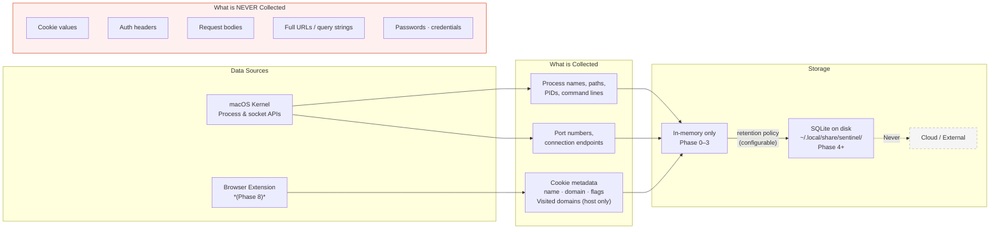
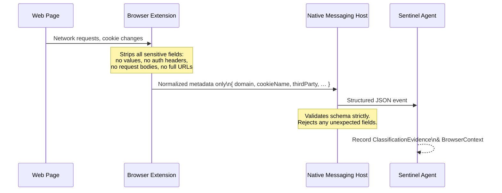

# Privacy Model

Sentinel is built local-first. Every piece of data it collects stays on your machine by default. This document is the authoritative record of what is and is not collected, where data goes, and how long it is kept.

---

## Data flow overview



---

## What Sentinel collects

| Data | Collected | Notes |
|---|---|---|
| Process names and PIDs | Yes | Used to identify running programs |
| Executable paths | Yes | Used to assess location (Downloads, /tmp, etc.) |
| Command-line arguments | Yes | Stored in memory; not persisted in Phase 0–3 |
| Usernames | Yes | Identifies which user account owns a process |
| Parent PID | Yes | Used for process ancestry analysis |
| Process start time | Yes | Required for stable process identity (PID reuse safety) |
| Listening port numbers and protocols | Yes | Core port monitoring feature |
| Active connection endpoints (IP + port) | Yes | Core network monitoring feature |
| Executable file hashes | Deep scan only | Computed on demand; cached by hash + ruleset version |
| Code signing status | Deep scan only | macOS codesign result — not the certificate itself |
| Cookie name, domain, and flags | Phase 8 only | Metadata only — **never the value** |
| First-party and third-party domains visited | Phase 8 only | Host/domain level only — not the full URL |

---

## What Sentinel never collects

| Data | Why it is excluded |
|---|---|
| Cookie values or session tokens | Direct credential/session risk if stored locally |
| Browser authentication headers | Contains tokens and passwords |
| HTTP request or response bodies | May contain sensitive user data |
| Full URL paths and query strings | May contain tokens, PII, or private identifiers |
| File contents | Not necessary; hashes provide integrity checking without exposure |
| Passwords or secrets of any kind | Never in scope |
| Geolocation data | Not relevant to the product's security goals |
| Cloud account credentials | The product has no cloud backend |

---

## Where data is stored

| Phase | Storage | Location |
|---|---|---|
| 0–3 (current) | In-memory only | Cleared when the process exits |
| 4+ | SQLite database | `~/.local/share/sentinel/sentinel.db` |

The data directory path is configurable via `SENTINEL_DATA_DIR`.

Sentinel does **not** write to system locations, shared directories, or locations accessible by other users.

---

## Data retention

- **Phase 0–3:** No persistence. All collected data is held in memory for the duration of the scan and discarded on exit.
- **Phase 4+:** Events are persisted to SQLite. A configurable retention policy will control how long historical events are kept. The default will be 30 days.
- **Users can delete all stored data** at any time:
  ```bash
  rm -rf ~/.local/share/sentinel/
  ```

---

## External communication

**Sentinel makes no outbound network requests in V1.**

Future phases may introduce optional external lookups for IP/domain reputation. These will:
- Be disabled by default
- Require explicit user opt-in via configuration
- Be clearly documented in this file when introduced
- Be logged so users can see exactly what was queried

---

## Browser extension (Phase 8)



Rules that apply to all browser data:
- Cookie **values** are never collected or transmitted, even to the local agent
- Authorization headers are never collected
- Request bodies are never collected
- Full URLs are not persisted — the host/domain is sufficient for classification
- The native messaging host only accepts events from the specific registered extension origin

---

## Sensitive data in logs

Sentinel's internal logs are structured and directed to stderr. They never contain:
- Cookie values
- Authentication headers
- Full browser URLs
- File contents

Log level is `WARNING` by default. Debug logging (`SENTINEL_LOG_LEVEL=DEBUG`) is scoped to internal system operations and still excludes the values listed above.

---

## Summary

| Property | Value |
|---|---|
| Cloud backend | None |
| Data sent off-device | Nothing (Phase 0–8) |
| Persistent storage introduced | Phase 4 |
| Default storage location | `~/.local/share/sentinel/` |
| Cookie values stored | Never |
| Full URLs stored | Never |
| User action to delete all data | `rm -rf ~/.local/share/sentinel/` |
