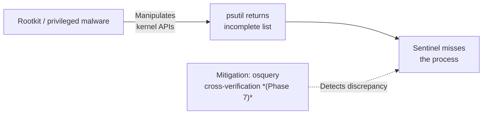
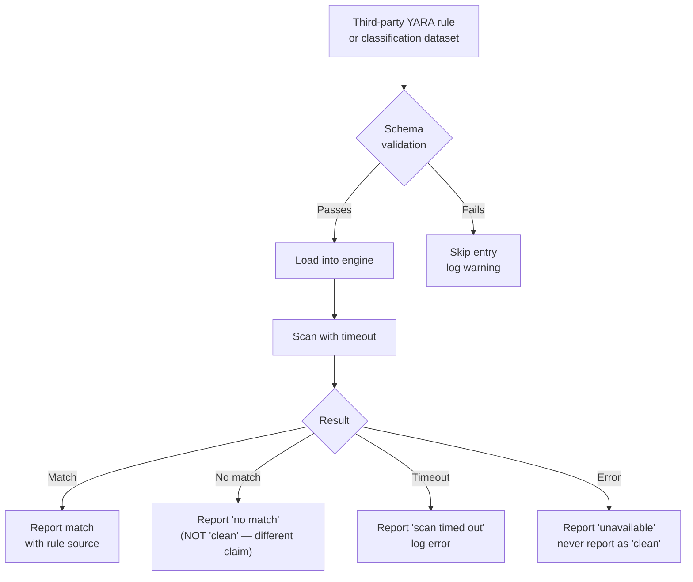
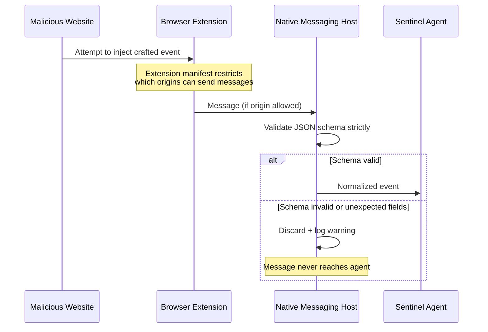

# Threat Model

This document describes threats *to Sentinel itself* — ways the monitoring tool could be subverted, abused, or bypassed. It is distinct from the threats Sentinel is designed to *detect*.

---

## Threat landscape overview

```mermaid
mindmap
  root((Sentinel\nThreats))
    Process Visibility
      Privileged process hiding from psutil
      Kernel-level rootkit bypassing APIs
    Data Integrity
      SQLite database tampering
      False finding injection
    Rule & Data Quality
      Malicious or crashy YARA rules
      Poisoned classification datasets
    Privilege Boundaries
      Escalation via file-reading code path
      Symlink and path traversal attacks
    Browser Integration
      Rogue extension origin spoofing
      Injected native messaging events
    Resource Exhaustion
      Unbounded deep scan loops
      Repeated YARA execution on same file
    Network Exposure
      Local API binding externally *(Phase 9)*
      Unsafe parsing of Suricata/Zeek logs
```

---

## Scope

- Sentinel is an observation tool. It does not block, kill, or modify processes.
- It runs as a normal user process with no persistent elevated privileges.
- Attack surface: local SQLite database, YARA-X rule engine, optional external data feeds, browser native messaging host, and the file-reading paths used during deep scans.

---

## Threat details

### 1. Malicious process hiding from the collector



**Likelihood:** Low for commodity malware; higher for kernel-level threats.

**Mitigations:**
- Phase 7: osquery provides a cross-verification source. If psutil and osquery disagree on the process list, the discrepancy is surfaced as a finding.
- Phase 11: Document explicitly that Sentinel is not a kernel-level EDR and does not claim kernel-rootkit detection.

---

### 2. Tampering with the local database

**Likelihood:** Medium — any process running as the same user can write to the database file.

**Mitigations:**
- Store `sentinel.db` with `0600` permissions (user read/write only).
- Phase 11: Add a database integrity check (`PRAGMA integrity_check`) on startup.
- The database is an audit trail, not a real-time trust boundary. Sentinel re-collects live state on every scan and does not rely solely on persisted data for current decisions.

---

### 3. Untrusted YARA rules or classification data



**Likelihood:** Low for trusted sources; higher for user-supplied or third-party feeds.

**Mitigations:**
- All YARA-X scans run with a configurable per-file timeout.
- Rules are version-tagged; changes are logged.
- Classification data is parsed through strict Pydantic schemas. Unexpected fields are ignored; parse errors skip the entry and log a warning.
- Phase 11: Signed update channel for rules and data so authenticity can be verified.

---

### 4. Privilege escalation via Sentinel

**Likelihood:** Low — Sentinel is designed to run as a normal user.

**Mitigations:**
- Sentinel requires no root to run. Core monitoring degrades gracefully on `AccessDenied`.
- `sudo sentinel` is supported for full network visibility but is never required and not the default workflow.
- Sentinel never executes files it inspects — only reads them. File scanning is strictly read-only.
- Phase 11: Security review of all file-reading and shell-interaction code paths before packaging.

---

### 5. Browser extension / native messaging abuse



**Likelihood:** Low if messaging host manifest is correctly locked down.

**Mitigations:**
- The native messaging host manifest specifies the exact extension ID(s) permitted to communicate.
- All messages are parsed with a strict schema. Any message that fails validation is discarded and logged.
- The host never evaluates or executes received content.
- Cookie values and auth headers are excluded from messages even if an extension attempts to send them.

---

### 6. Symlink and path traversal attacks

**Likelihood:** Low but non-zero for targeted attacks against the deep scan path.

**Mitigations:**
- Symlinks are resolved to their real path before scanning; both the symlink and real target are recorded.
- Deep scans are constrained to the executable paths of running processes — no unbounded directory traversal.
- File reads use bounded sizes where possible. Sentinel does not mmap arbitrary files.

---

### 7. Unsafe parsing of third-party logs or data feeds

**Likelihood:** Low for maintained datasets; higher for self-hosted or user-supplied feeds.

**Mitigations:**
- All external data is parsed through Pydantic models. Unexpected fields are ignored; missing required fields skip the entry.
- Parse errors are logged at WARNING level and never silently swallowed.
- Adapters that fail to parse their input report themselves as `unavailable`, not `clean`. Sentinel never infers safety from a parse failure.

---

### 8. Denial of service via expensive scans

**Mitigations:**
- YARA-X scanning is gated behind a content hash cache: unchanged files are not rescanned.
- YARA-X scans run with a configurable timeout per file.
- The always-on live monitor uses snapshot diffing — only changes trigger new work, not every poll tick.

---

## Threat summary

| # | Threat | Likelihood | Status |
|---|---|---|---|
| 1 | Process hiding from psutil | Low–Medium | Partial; osquery cross-check in Phase 7 |
| 2 | Database tampering | Medium | Mitigated by file permissions; integrity check in Phase 11 |
| 3 | Untrusted YARA / data | Low | Mitigated by schema validation + timeouts |
| 4 | Privilege escalation | Low | Mitigated by design; review in Phase 11 |
| 5 | Native messaging abuse | Low | Mitigated by origin restriction + schema validation |
| 6 | Symlink / path traversal | Low | Mitigated by symlink resolution + bounded scope |
| 7 | Unsafe log parsing | Low | Mitigated by Pydantic + error handling |
| 8 | Resource exhaustion | Low | Mitigated by hash cache + scan timeouts |

---

## Out of scope

| Threat | Rationale |
|---|---|
| Kernel rootkit bypassing both psutil and osquery | Requires kernel-level defenses outside the scope of a user-space tool |
| Physical access attacks | Out of scope for all user-space software |
| Network-based attacks against the local API | Phase 9 API binds to loopback only; not exposed externally by design |
| Supply chain compromise of Python dependencies | Addressed by `poetry.lock` pinning and standard dependency audit tooling |
